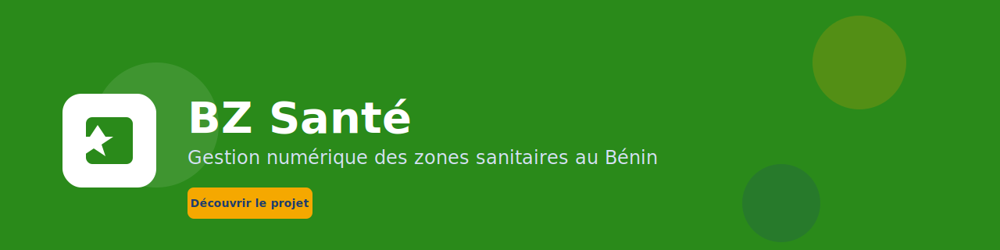
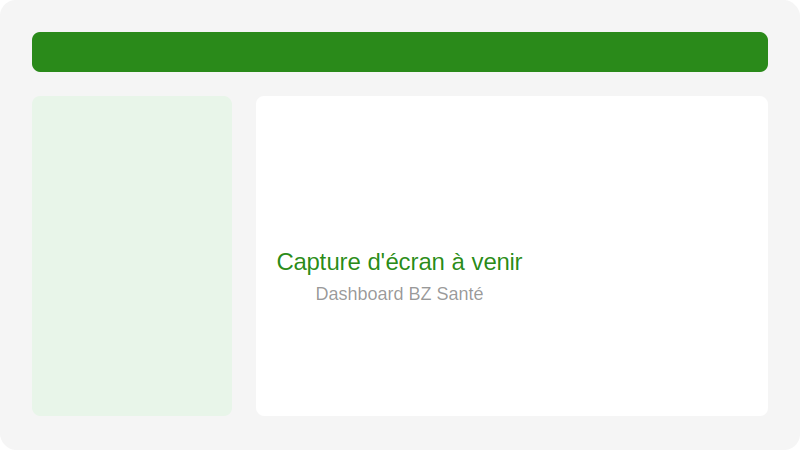

  

  
  <h1>BZ Santé</h1>
  
<strong>Système numérique de gestion des zones sanitaires au Bénin</strong>

  

    
    
    
    
  

---

## Table des matières

- [Présentation](#présentation)
- [Le problème](#le-problème)
- [La solution](#la-solution)
- [Fonctionnalités principales](#fonctionnalités-principales)
- [Architecture générale](#architecture-générale)
- [Technologies utilisées](#technologies-utilisées)
- [Feuille de route](#feuille-de-route)
- [Captures d'écran](#captures-décran)
- [Démo](#démo)
- [Liens officiels](#liens-officiels)
- [Contact](#contact)

---

## Présentation

**BZ Santé** (Bureau de Zone Santé) est une plateforme numérique dédiée à la gestion des activités sanitaires au niveau des zones de santé au Bénin. Elle accompagne les agents de santé, les infirmiers, les sages-femmes et les administrateurs dans la collecte, le suivi et l'analyse des données de santé.

L'application vise à moderniser la gestion des consultations, des maternités, des vaccinations, des statistiques et des ressources humaines des centres de santé.

---

## Le problème

Les bureaux de zone santé au Bénin font face à plusieurs défis :
- Gestion des dossiers patients sur papier, difficilement consultables et partageables.
- Absence de statistiques en temps réel pour la prise de décision.
- Coordination limitée entre les centres de santé, les maternités et les autorités sanitaires.
- Perte de temps et erreurs lors de la saisie et du rapprochement des données.
- Difficulté à suivre les indicateurs de santé publique (vaccinations, accouchements, mortalité, etc.).

---

## La solution

BZ Santé propose un écosystème numérique composé de :

- **Application mobile Flutter** : saisie des consultations, patients, maternités et activités sur le terrain.
- **Dashboard web** : visualisation des statistiques, suivi des indicateurs et supervision des activités.
- **Backend sécurisé** : gestion centralisée des données, authentification, rôles et permissions.
- **Rapports automatiques** : génération de rapports sanitaires pour les bureaux de zone et les autorités.
- **Gestion des utilisateurs** : rôles adaptés aux agents de santé, superviseurs et administrateurs.

---

## Fonctionnalités principales

- **Gestion des patients** : dossiers patients, historique des consultations, informations démographiques.
- **Consultations** : enregistrement des consultations, symptômes, diagnostics et traitements.
- **Maternité** : suivi des accouchements, des nounés et des mères.
- **Vaccination** : calendrier vaccinal, suivi des doses et rappels.
- **Statistiques sanitaires** : tableaux de bord par zone, par centre et par période.
- **Rapports** : génération automatique de rapports mensuels et annuels.
- **Gestion des utilisateurs** : agents de santé, superviseurs, administrateurs.
- **Synchronisation** : travail hors ligne avec synchronisation lors de la connexion.
- **Notifications** : rappels de vaccination, alertes et messages aux agents.

---

## Architecture générale

BZ Santé repose sur une architecture hybride mobile/web avec backend API :

- **Application mobile** : Flutter pour Android et iOS, avec mode hors ligne.
- **Dashboard web** : React ou Vue.js avec TailwindCSS.
- **Backend API** : Node.js avec Express et base de données relationnelle.
- **Base de données** : SQLite local sur mobile, base centralisée côté serveur.
- **Authentification** : JWT avec rôles spécifiques.
- **Rapports** : moteur de génération de PDF et d'exports Excel.
- **Déploiement** : compatible avec hébergement mutualisé et cloud.

Pour plus de détails, consulter :
- [`docs/architecture.md`](docs/architecture.md)
- [`docs/features.md`](docs/features.md)
- [`docs/business-model.md`](docs/business-model.md)
- [`docs/api.md`](docs/api.md)
- [`docs/faq.md`](docs/faq.md)

---

## Technologies utilisées

### Mobile

### Backend

### Base de données

### Frontend

### Outils

---

## Feuille de route

| Phase | Objectif | Statut |
| :--- | :--- | :--- |
| **Phase 1** | Application mobile Flutter, saisie patient et consultation | En cours |
| **Phase 2** | Backend API et synchronisation centralisée | À venir |
| **Phase 3** | Dashboard web et rapports statistiques | À venir |
| **Phase 4** | Module maternité et vaccination | À venir |
| **Phase 5** | Déploiement pilote dans une zone de santé | À venir |
| **Phase 6** | Expansion nationale et intégration ministérielle | À venir |

Consulter [`ROADMAP.md`](ROADMAP.md) pour le détail.

---

## Captures d'écran

> Les captures d'écran seront ajoutées progressivement dans le dossier [`assets/screenshots/`](assets/screenshots/).

  
  
<em>Dashboard BZ Santé — placeholder</em>

---

## Démo

Une démo publique sera disponible prochainement dans le dossier [`demo/`](demo/).

---

## Liens officiels

- **Site web** : [À compléter](https://)
- **Documentation** : [`docs/`](docs/)
- **Portfolio** : [stanislas-nouemou](https://github.com/odsystem-bit/stanislas-nouemou)
- **GitHub** : [bz-sante](https://github.com/odsystem-bit/bz-sante)

---

## Contact

Pour toute question, partenariat ou opportunité d'investissement :

- **Email** : [À compléter](mailto:)
- **LinkedIn** : [À compléter](https://linkedin.com/in/)
- **GitHub** : [@odsystem-bit](https://github.com/odsystem-bit)

---

  BZ Santé — La santé publique, simplifiée et numérisée.

